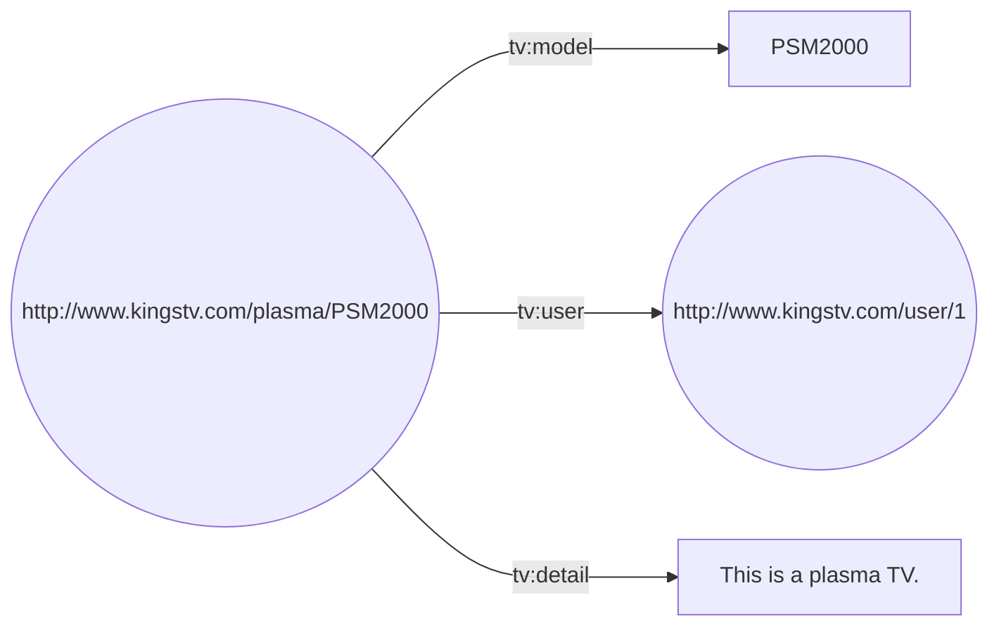

# Web Semantica usando Python

### Ejemplos de RDF implementados en Python(Con fines Educativos)

Tutorial sobre RDF utilizando RDFLib basado en el documento [A tutorial on RDF with Jena
](https://www.researchgate.net/publication/292886404_A_tutorial_on_RDF_with_Jena).

### 1. Instalación

RDFLib es un paquete de código abierto desarrollado para trabajar con RDF y se mantiene en un repositorio de [GitHub](https://github.com/RDFLib/rdflib/). La version mas reciente y previa pueden encontrarse utilizando pip.

La mejor manera de instalar RDFLib es usando pip:

```shell
pip install rdflib 
```

### 2. Ejemplo 1

Durante este tutorial se utilizara un televisor como recurso. La URI utilizada para referirnos a este elemento es `http://www.kingstv.com/plasma/PSM2000`. Para este recurso, se tomara el nombre, detalles y la persona que usa el dispositivo como sus propiedades. Esta situacion se puede resumir en la siguiente tabla:

| Sujeto | Predicado | Objecto |
| -------| --------  | ------- |
| http://www.kingstv.com/plasma/PSM2000 | http://www.kingstv.com/tv_property/model | PSM2000 |
| http://www.kingstv.com/plasma/PSM2000 | http://www.kingstv.com/tv_property/detail | This is a plasma TV. |
| http://www.kingstv.com/plasma/PSM2000 | http://www.kingstv.com/tv_property/user | http://www.kingstv.com/user/1 |


La tabla anterior es equivalente al siguiente grafico:


