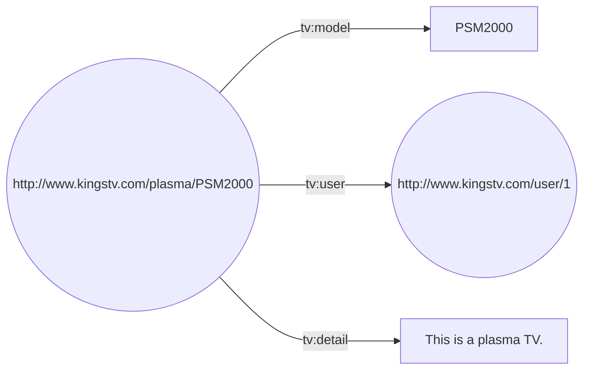

# Web Semantica usando Python

### Ejemplos de RDF implementados en Python(Con fines Educativos)

Tutorial sobre RDF utilizando RDFLib basado en el documento [A tutorial on RDF with Jena
](https://www.researchgate.net/publication/292886404_A_tutorial_on_RDF_with_Jena).

### 1. Instalación

RDFLib es un paquete de código abierto desarrollado para trabajar con RDF y se mantiene en un repositorio de [GitHub](https://github.com/RDFLib/rdflib/). La version mas reciente y previa pueden encontrarse utilizando pip.

La mejor manera de instalar RDFLib es usando pip:

```shell
pip install rdflib 
```

### 2. Ejemplo 1

Durante este tutorial se utilizará un televisor como recurso. La URI utilizada para referirnos a este elemento es `http://www.kingstv.com/plasma/PSM2000`. Para este recurso, se tomará el nombre, detalles y la persona que usa el dispositivo como sus propiedades. Esta situación se puede resumir en la siguiente tabla:


| Sujeto | Predicado | Objecto |
| -------| --------  | ------- |
| http://www.kingstv.com/plasma/PSM2000 | http://www.kingstv.com/tv_property/model | PSM2000 |
| http://www.kingstv.com/plasma/PSM2000 | http://www.kingstv.com/tv_property/detail | This is a plasma TV. |
| http://www.kingstv.com/plasma/PSM2000 | http://www.kingstv.com/tv_property/user | http://www.kingstv.com/user/1 |


La tabla anterior es equivalente al siguiente grafico:




En la representación anterior se ha utilizado el prefijo `tv` para reemplazar parte de la URI utilizada en los predicados del grafico con la intencion de reducir el espacio ocupado por la representacion.

Para representar la informacion mostrada anteriormente utilizando codigo, lo primero que debemos hacer es crear un grafo vacío haciendo uso de la clase `Graph` como se muestra a continuacion:


```python
from rdflib import Graph

""" Create a base Graph """

graph = Graph()
```


Luego de crear el grafo que se utilizará como base, debemos definir el **namespace** para las propiedades de la representacion. Para esto, importamos la clase `Namespace`, creamos una instancia con la URI:**http://www.kingstv.com/tv_property/** y utilizamos el metodo `bind` de la clase `Graph` para añadirla al grafo, como se muestra a continuacion:


```python
from rdflib import Graph, Namespace
...

""" Create an Prefix to use for predicate in triples """
tv = Namespace("http://www.kingstv.com/tv_property/")
graph.bind("tv", tv)
```


Ahora se pueden definir los recursos con su propia URI utilizando la clase `URIRef` como se muestra a continuacion:


```python
from rdflib import Graph, Namespace, URIRef
...

""" Create an RDF node to use as the subject for triples """
psm2000 = URIRef("http://www.kingstv.com/plasma/PSM2000")
user1 = URIRef("http://www.kingstv.com/user/1")
```
Ademas, se pueden referir aquellos objetos que estan representados por literales. Para esto importamos la clase `Literal` y la usamos como se muestra a continuacion:


```python
from rdflib import Graph, Namespace, URIRef
...
""" Create literals"""
name = Literal("PSM2000")
detail = Literal("This is a plasma TV.")
```

Ahora solo debemos añadir los tripletes definidos en la tabla de este ejemplo. Para esta tarea, utilizamos el metodo `add` disponible en la instancia de la clase `Graph`, como se muestra a continuacion:

```python
""" Create triples"""
graph.add((psm2000, tv.model, name));
graph.add((psm2000, tv.detail, detail));
graph.add((psm2000, tv.user, user1));
```

Finalmente, podemos imprimir la representacion del grafo utilizando distintos formatos de serializacion (se puede consultar la lista en este [enlace](https://rdflib.readthedocs.io/en/stable/plugin_serializers.html)). Para este ejemplo usaremos el formato RDF/XML:

```python
print(graph.serialize(format='xml'))
```